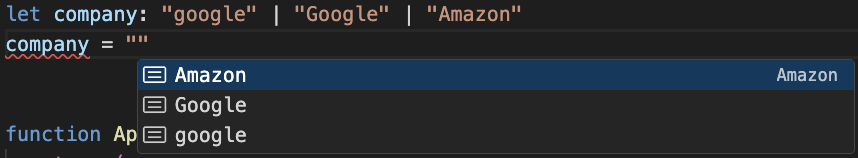
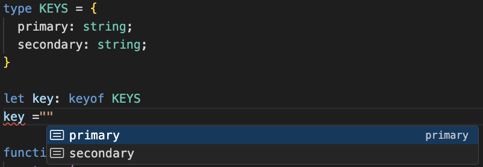
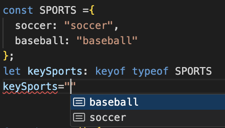
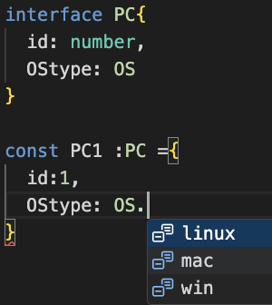
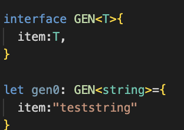
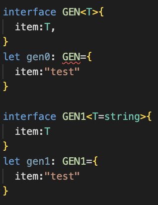
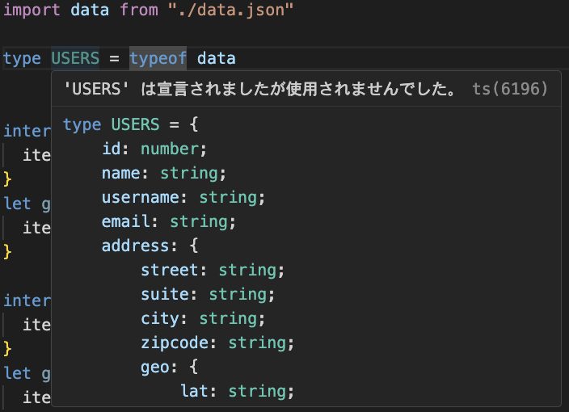
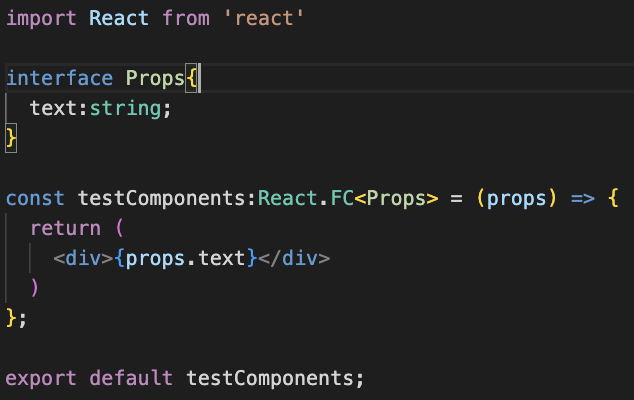
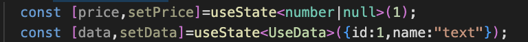

# 学んだこと
udemyの講座を受講
[最速で学ぶTypeScript](https://www.udemy.com/course/typescript-react-frontend/)

## 環境について

### `テンプレートの作成`
```npx create-react-app . --template typescript```


### `extension prettier code formatter`
コードのインデントやスペースなどをセーブ時に整形してくれる\
settingsにて設定が必要


## TypeScript

## 1. TypeScriptのデータ型

### 型の推論
コンパイラが自動で推論してくれる
```
const username ="Hello";
```

### アノテーション
`変数名: 型`と記述することで明示的に型を指定することもできる
```
let username: string = "Hello";
```

### 代表できなデータ型
- string
- number
- boolean

### 配列のデータ型
`型名[]`で定義できる\
文字列または数字`(string | number)[]`のように複数混ぜることも可能。


### オブジェクト型の定義
interfaceを使う
```
interface NAME {
  first: string;
  last: string;
}
```
使う時は型に定義した構造体名を使用
```
let name: NAME ={first:"Yamada" ,last:"Taro"}
```
ある要素は入れてあげないとエラーが発生してしまう。
```
let name: NAME ={first:"Yamada"}
```

代入がない場合、ないものとして扱いたい場合は型定義時に?を設定する
```
interface NAME {
  first: string;
  last?: string;
}
```

同様にstring以外のnullを受け取るといったこともできないので、型定義に入れ込んであげる必要がある
```
interface NAME {
  first: string;
  last: string | null;
}
let name: NAME ={first: "Yamada" ,last: null}
```

### 関数のデータ型
引数と戻り値にそれぞれ型の設定ができる。\
他の定義と同様に、明示的でなくても推論して設定してくれる。
```
const func1 = (x: number, y: number): number =>{
  return x + y;
}
```


## 2. Intersection Types
複数のTypeを結合する処理
```
type PROFILE={
  age: number;
  city: string;
};

type LOGIN ={
  userame: string;
  password: string;
}

# 結合して使える
type USER= PROFILE & LOGIN

const typeA: USER ={
  age: 20,
  city: "Tokyo",
  userame: "akira",
  password: "1234"
}
```

## 3.UnionTypes
肩を`|`で繋ぐことで複数の型で制限できる

```
let value: boolean | number
```


## 4.LiteralTypes
変数に入るリテラルを制限できる
```
let company: "google" | "Google" | "Amazon"
company = 'Amazon'
```
候補に出てきたりといった便利なことも



## 5.typeof
宣言済み変数の型を使って定義できる
活用例としてはjsonなどの複雑なデータ型の定義に使う\
モジュールを使用する場合など開発車側が意識する必要がなくなる

```
let message: string ="Hi";
let message2: typeof message;
```

## 6.keyof
キーの名前をリテラルとして型定義できる

typeofと組み合わせて使うこともできる


## 7.enum
連番を付与した定義を用意することができる
```
enum OS {
  win,
  mac,
  linux
}
```
列挙型で型定義しておくことで宣言時に列挙定数を活用できる\


## 8.型の互換性
より抽象度の高い型へ代入する場合、問題にならない\
例えば文字のリテラル型から、文字型への代入は
文字型の方が抽象度が高いため問題にならない
```
let company:"google"|"amazon"
company="amazon"
let text:string = company
```
逆に文字型から文字リテラル型への代入は、
抽象度が低い方への代入となり、エラーが発生する


## 9.Generics ジェネリックス
データ型定義時ではなく変数宣言時に型を決める場合に使う\
テンプレートだけようしておき、
具体的なデータ型は後で決める。
といったときに使用する


変数宣言時に型を定義しない場合、エラーとなるが
デフォルト型を決めておくことでこれを会議できる


### extends
extendsを使うことで、テンプレートのデータ型を制限できる
interface GEN2<T extends string|number>{
  item:T
}

### json型推論
jsonから受け取ったデータをtypeofすることで、データ構造を定義する必要がなくなる。



## React Hooks Props
propsにデータ型をつける場合は



## React useState
同様にUseStateに対してもジェネリクスを利用する。
